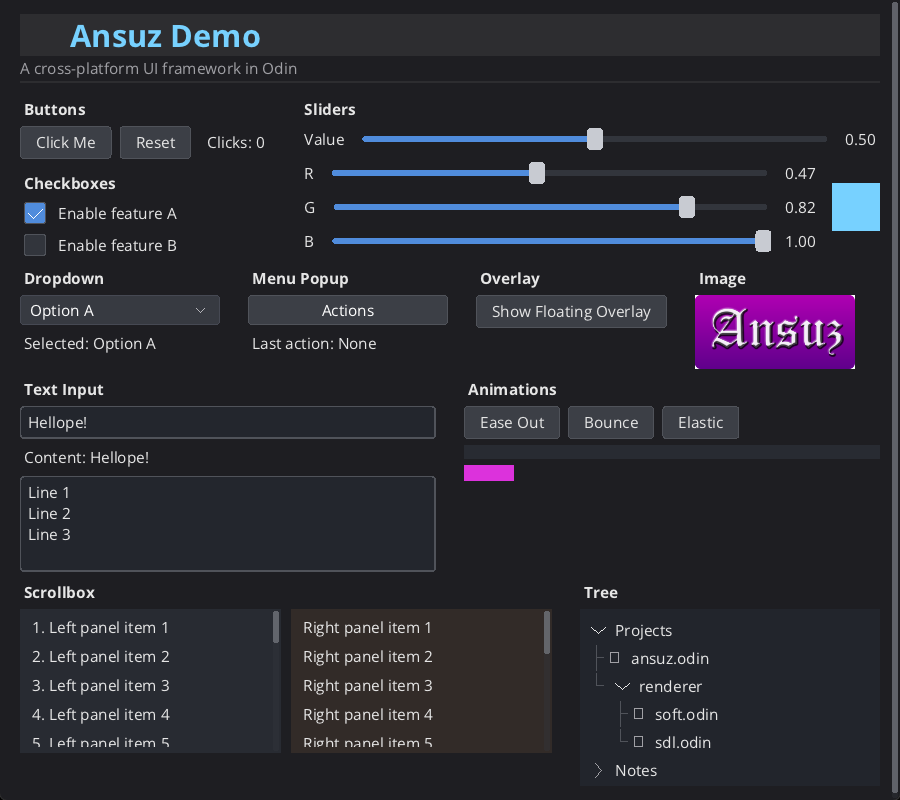
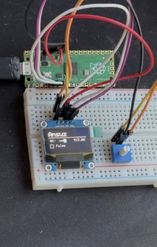

# Ansuz

Ansuz is a cross-platform UI framework written in Odin.

It offers an immediate-mode authoring style with a retained internal state manager, so you can write straightforward per-frame UI code while the framework tracks widget state, interaction, and transitions across frames.



## AI Disclosure
AI was used to assist in development of Ansuz, mostly for refactoring/cleanup and some more esoteric system call stuff.

## Status
Ansuz is still in development, the syntax especially is still quite inconsistant. PRs welcome.

## Highlights

- Immediate-mode API with internal state retention
- Flexible layout system:
  - Flex containers
  - Grid containers
  - Scroll containers
- Built-in widgets:
  - Label and heading
  - Button
  - Checkbox
  - Slider
  - Dropdown
  - Text input (single-line and multi-line)
  - Image widget
- Animation support with easing functions
- Font support:
  - Built-in bitmap font
  - TTF loading for higher-quality text
- Multiple backends:
  - SDL3 renderer backend
  - Software renderer backend (embedded-style framebuffer path)
  - WebGL backend for `js_wasm32`

## Repository Layout

- `ansuz/`: Core UI framework package
- `backend_sdl/`: SDL3 backend implementation
- `backend_soft/`: Software framebuffer backend
- `backend_webgl/`: WebGL backend for web builds
- `bindings/c/`: Complete C ABI and public header for Arduino/freestanding use
- `demo/`: Desktop SDL demo
- `demo_soft/`: Software renderer demo
- `demo_web/`: WebAssembly/WebGL demo

## Requirements

- Odin compiler (recent version with `js_wasm32` support for web builds)
- SDL3 available for desktop demos/backends
- Python (optional, only to serve web demo locally)

## Quick Start (Desktop SDL)

This is the minimal frame loop pattern with the SDL backend:

```odin
package main

import ansuz "../ansuz"
import backend "../backend_sdl"

main :: proc() {
    sdl := backend.create(960, 540, "ansuz app")
    if !sdl.init(&sdl, sdl.width, sdl.height) {
        return
    }
    defer sdl.shutdown(&sdl)

    mgr: ansuz.Manager
    ansuz.init(&mgr, &sdl)
    defer ansuz.shutdown(&mgr)

    // Built-in bitmap font defaults are available immediately.
    ansuz.DEFAULT_FONT_SCALE = 2

    for !ansuz.should_quit(&mgr) {
        ansuz.frame_begin(&mgr)

        ansuz.flex_begin(
            &mgr,
            axis = .Vertical,
            gap = 10,
            size = {ansuz.SIZE_GROW, ansuz.SIZE_GROW},
            padding = {16, 16, 16, 16},
        )

        ansuz.label(&mgr, "Hello from ansuz")
        _ = ansuz.button(&mgr, "Click")

        ansuz.flex_end(&mgr)

        ansuz.frame_end(&mgr)
    }
}
```

## Running the Demos

From the repository root:

### 1. SDL Desktop Demo

```powershell
odin run demo
```

### 2. Software Renderer Demo

```powershell
odin run demo_soft
```



### 3. Web Demo (WASM + WebGL)

Windows:

```powershell
cd demo_web
.\build.bat
cd web
py -m http.server 8080
```

macOS/Linux:

```bash
cd demo_web
./build.sh
cd web
python3 -m http.server 8080
```

Then open `http://localhost:8080`.

### 4. Arduino Static Library

```powershell
cd demo_arduino_oled
.\build.bat m4
# or:
.\build.bat rp2040
```

The build produces `build/libansuz.a` and `build/ansuz.h`. The Arduino sketch
constructs the UI directly through the C interface; no application-specific UI
code remains inside the Odin object. See
[`bindings/c/README.md`](bindings/c/README.md) for the lifecycle and API usage.

## Core Frame Lifecycle

Typical usage follows this order each frame:

1. `frame_begin`
2. Build layout and widgets (`flex_begin`/`flex_end`, `grid_begin`/`grid_end`, widget calls)
3. `frame_end`

Internally, ansuz resolves layout, emits draw commands, handles deferred text/custom draws, executes backend rendering, and updates persistent widget state.

## Backends

ansuz is backend-agnostic through the `Backend` interface in `ansuz/backend.odin`.

A backend provides function pointers for:

- Initialization and shutdown
- Per-frame begin/end hooks
- Draw command execution
- Text measurement
- Event polling
- Font upload

This allows the same UI code to run on desktop, embedded-style software pipelines, and web targets with backend-specific rendering/event handling.

## Fonts

- Omit `font` to use the manager's default font. The built-in bitmap font is the initial default.
- Use `FONT_BUILTIN` as an explicit per-widget override, even after setting a TTF default.
- Use `load_font` and `set_default_font` to change the manager default for all widgets.
- Demos use OpenSans for anti-aliased text rendering.

Text colors use a plain `Color` override, while interactive widgets accept a
`Widget_Color` palette for their state colors. All color arguments have built-in
defaults and can be omitted.

## Current Widget Set

Core widget modules currently include:

- `widgets.odin`
- `checkbox.odin`
- `slider.odin`
- `dropdown.odin`
- `textinput.odin`
- `scroll.odin`
- `image.odin`

Additional supporting systems include animations/easing, transitions, interaction state, and reactive value plumbing.

## Notes
- `SDL2.dll` may be present in the workspace, but the current desktop backend implementation imports SDL3 (`vendor:sdl3`).
